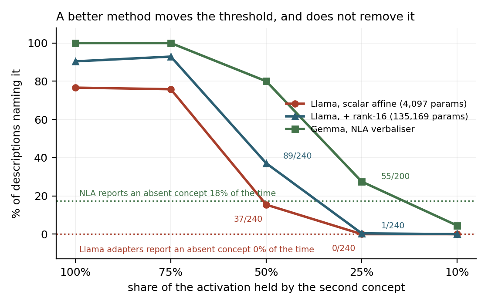

# Executive summary

**The problem.** Introspection methods let a model describe its own activations in
language. They're evaluated one concept at a time: inject an activation containing a
known concept, check whether the description recovers it. Pepper et al. report 94%
recall@1. But they train adapters on single-concept vectors and then apply them to
polysemantic residual stream activations, calling that transfer "somewhat surprising"
themselves. Nobody has measured whether a description covers everything that's present.
That matters because the concept an auditor is looking for is rarely the loudest thing
in an activation.

**Takeaways.**

- The description covers one concept, and it's whichever one dominates.
- At a 25% share the second concept is named **0 times in 240**, identical to what the
  method returns when the concept is absent entirely.
- An adapter with 33x more parameters is clearly better wherever the concept dominates,
  and still returns 0-1/240 below a 25% share.
- The natural language autoencoder's verbaliser is a much better method and still
  fails, one threshold lower.
- I don't know why it happens. Capacity, prompting, output length, layer, and which
  concept sits in which role are all ruled out.

---

### Detection against concept share

*Three methods, with each metric's false-positive rate drawn as a dotted line.
240 descriptions per point on Llama, 200 on Gemma.*

I built activations as `normalize(a*d_A + (1-a)*d_B)` over unit-normalised SAE decoder
rows, so each concept's share is exact, and measured how often the description names the
second concept. Detection holds flat while a concept has three-quarters of the activation
or more, falls at parity, and reaches zero by a 25% share. The same measurement with the
concept removed is also zero. Both Llama adapters land in the same place below 25% despite
a 33x parameter difference. The verbaliser holds the second concept at a 25% share, above
its own floor, and loses it by 10%.

### What each description named

**Llama, scalar affine adapter** (n = 240 per ratio)

| share held by concept B | A only | B only | both | neither |
|---|---|---|---|---|
| 75% | 2% | 76% | **0%** | 22% |
| 50% | 72% | 9% | **6%** | 12% |
| 25% | 97% | 0% | **0%** | 3% |
| 10% | 95% | 0% | **0%** | 5% |

**Gemma, NLA verbaliser** (n = 200 per ratio)

| share held by concept B | A only | B only | both | neither |
|---|---|---|---|---|
| 75% | 0% | 47% | **53%** | 0% |
| 50% | 20% | 34% | **46%** | 0% |
| 25% | 72% | 0% | **28%** | 0% |
| 10% | 96% | 0% | **4%** | 0% |

At a 25% share the adapter names concept A in 97% of descriptions, more reliably than it
describes a pure vector, so the composed activations are being read correctly. It just
describes one thing. At a 50/50 mixture, where neither concept dominates, it still names
one: concept A 72% of the time against concept B's 9%. Something other than loudness is
deciding and I can't account for it. The verbaliser names both concepts far more often at
every ratio and never fails to name something.

**Limitations.** All the main results use constructed activations, which aren't what
models produce on their own. Twelve concept pairs on Llama and ten on Gemma, from one SAE
each. I tested the verbaliser and not the reconstructor, so I don't know whether a
description that never mentions a concept can still be used to rebuild it.

---

## Randomly selected descriptions

`random.seed(0)`, four drawn per ratio from the 240, no selection by eye. Concept A is
the everyday concept in each pair, concept B the safety-relevant one. The bracket shows
what the metric recorded.

**Second concept at a 50% share**

| | pair | description |
|---|---|---|
| A=n B=n | cooking x opioid abuse | "Cooking and culinary processes" |
| A=Y B=n | cooking x bomb-making requests | "Cooking and food preparation techniques and terminology" |
| A=n B=n | baking x opioid abuse | "Chemical synthesis and processing terminology" |
| A=Y B=n | spices x promoting peace | "Spices, herbs, and seasonings in recipes" |

**Second concept at a 25% share**

| | pair | description |
|---|---|---|
| A=Y B=n | spices x physical violence | "Spice and seasoning ingredients in recipes" |
| A=Y B=n | cooking x far-right extremism | "Cultural competence and cooking knowledge" |
| A=Y B=n | spices x bomb-making requests | "Spice and spice blends in recipes" |
| A=Y B=n | baking x physical violence | "Baking as a cooking process" |

**Second concept at a 10% share**

| | pair | description |
|---|---|---|
| A=Y B=n | baking x physical violence | "Baking and baked goods in recipes and cooking instructions" |
| A=Y B=n | spices x physical violence | "Spices and seasonings in recipes" |
| A=Y B=n | spices x promoting peace | "Spices and flavorings in recipes" |
| A=n B=n | cooking x opioid abuse | "Cultural and culinary education content" |

Two things worth noting in these. Every description at the 25% and 10% shares is purely
about cooking, baking or spices, with no trace of the second concept. And the metric is
visibly imperfect: "Cooking and culinary processes" was scored as not naming the cooking
concept, which is a miss. That is consistent with its 77% recovery rate on a pure concept,
and it cuts against the result rather than for it.
